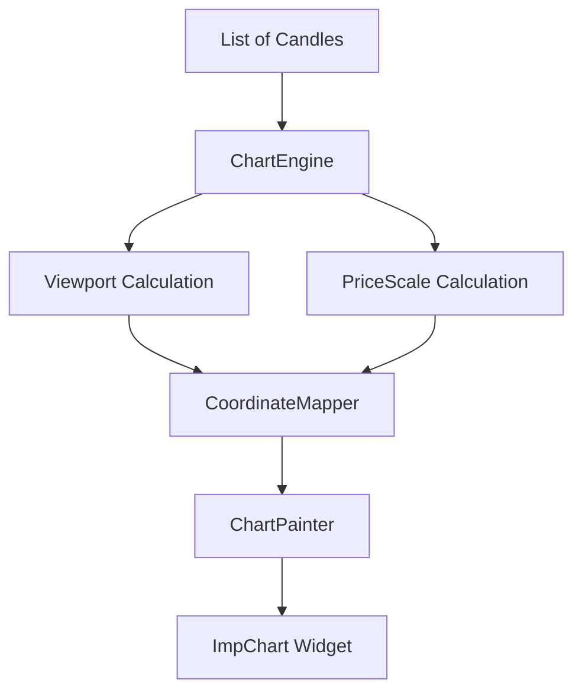
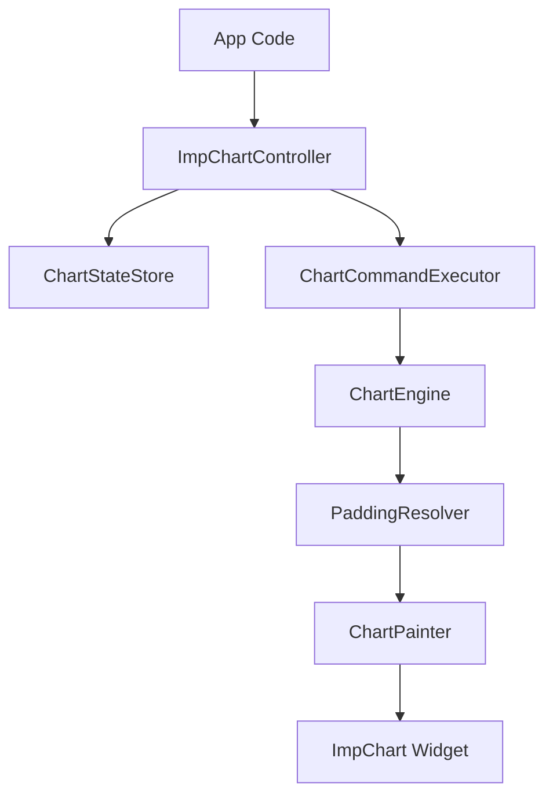

# Architecture Documentation

## Engine-First Philosophy
`imp_trading_chart` is built as a **rendering engine**, not just a collection of Flutter widgets. This separation ensures that the core logic (scaling, viewports, coordinate mapping) is decoupled from the Flutter widget tree, allowing for high-performance updates and a cleaner codebase.

## Data Flow

## Controller-Centered Runtime Flow

### Package Layers
- **Public API**: `ImpChart`, `ImpChartController`, snapshots, events, styles, data models
- **Controller Layer**: command execution, follow-latest behavior, selection state, event emission
- **Core Engine Layer**: viewport math, price scale, coordinate mapping, visible-range computation
- **Rendering/Layout Layer**: padding resolution, painter orchestration, draw delegates
- **Widget Layer**: Flutter binding, gesture forwarding, animation-only UI state

### 1. ChartEngine
The `ChartEngine` is the brain of the package. It holds the immutable state of the chart, including the full list of candles and the current viewport.
- **Immutability**: Every update creates a new engine instance, making the state predictable and easy to reason about.
- **Caching**: It caches the `PriceScale` to avoid recalculating min/max prices on every frame unless the viewport changes.

### 1.1 ImpChartController
`ImpChartController` is now the public orchestration layer for advanced integrations.
- **Programmatic control**: pan, zoom, reset, fit-all, scroll-to-latest
- **Observation**: immutable viewport/state snapshots and event stream
- **Safety**: keeps internal engine types out of the public integration path
- **Compatibility**: remains optional; legacy `ImpChart(...candles: ...)` usage still works

### 1.2 Live Follow State
The controller uses an explicit live-view policy with three states:
- `followingLatest`
- `detachedNearLatest`
- `detachedHistorical`

Default UX:
- auto-follow while the viewport is at or within `3` candles of the latest candle
- preserve user context when the user has moved further back in history
- surface a `Live` affordance when updates arrive while detached, so returning to latest is explicit and user-controlled
- restore follow-latest on `scrollToLatest()` and viewport reset

### 1.3 Rendering Delegates
`ChartPainter` now acts as an orchestration shell instead of a monolithic renderer.

Internal render responsibilities are split into:
- `LineRenderer`
- `GridRenderer`
- `AxisLabelRenderer`
- `CurrentPriceRenderer`
- `RippleRenderer`
- `CrosshairRenderer`

This keeps drawing concerns isolated, makes future overlays safer to add, and avoids coupling painter internals to controller or widget logic.

### 1.4 Thin Widget Binding
`ImpChart` now stays focused on Flutter binding concerns:
- controller lifecycle binding
- gesture forwarding
- crosshair bridge
- pulse animation coordination
- live-update affordance display

The animation and interaction mechanics are delegated to internal widget helpers instead of accumulating inside one large state class.

### 2. Viewport (`ChartViewport`)
The viewport defines exactly which portion of the data is currently visible on the screen.
- **startIndex**: The first visible candle's index.
- **visibleCount**: How many candles are shown at once.
- **Performance**: By only rendering the visible slice of data, we keep the frame rate high even with thousands of candles.

### 3. PriceScale
The `PriceScale` maps price values to a vertical range (0.0 to 1.0).
- **Padding**: It includes a configurable padding percentage so that candles don't touch the top or bottom edges.
- **Inversion**: Financial charts typically have higher prices at the top, so the mapping is inverted relative to standard screen coordinates.

### 4. Rendering Pipeline
The rendering is handled by the `ChartPainter`, a `CustomPainter` shell that uses `CoordinateMapper` and focused draw delegates to translate data points (index, price) into screen pixels (X, Y).
- **CoordinateMapper**: A bridge that takes the viewport and price scale and computes exact X and Y offsets.
- **Delegate-based drawing**: each renderer owns one visual concern instead of one large painter owning everything.
- **Stateless painting**: rendering remains mutation-free and driven entirely by controller/engine state.

## Why Immutability & Caching?
- **Immutability**: Prevents side effects and makes it easier to implement features like undo/redo or state comparison. In Flutter, it perfectly aligns with the `didUpdateWidget` lifecycle.
- **Caching**: Calculating the min/max price for a viewport requires iterating over all visible candles. Caching this result ensures that as long as the viewport doesn't move, the rendering is extremely fast.
